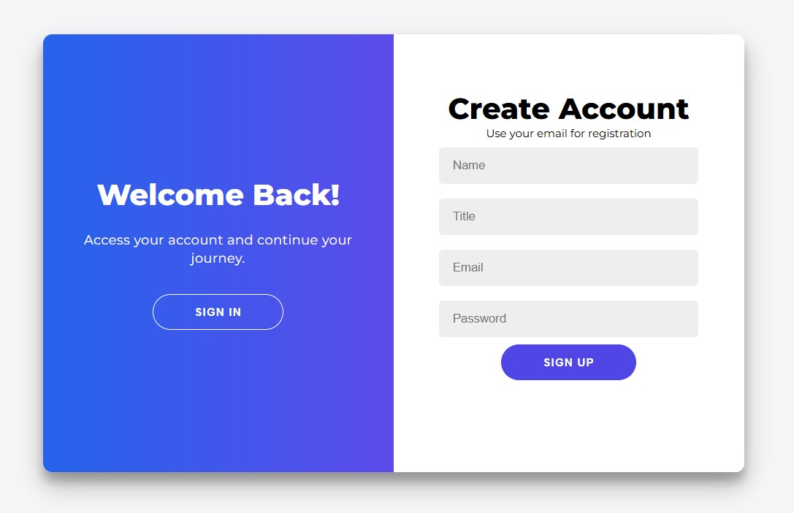

# LoginSignup-WebAppsGoogle

This web app provides a **Login & Signup** system with email validation, verification token, and OTP for password reset. It is built using **Google Apps Script** and connected to **Google Sheets** as the user database.

---

## 📂 Project Structure

```
LoginSignup-WebAppsGoogle/
│
├─ Code.gs # Main Apps Script file (backend)
├─ index.html # Main web page (signup & login)
├─ javascript.html # Frontend scripts (AJAX & form handling)
├─ stylesheet.html # CSS styles
└─ docs/ # Folder for additional documentation
```

---

## ⚙️ Features

- Signup with **Name**, **Title**, and **Email**  
- Email validation and password hashing  
- Email verification with unique token  
- Login with email status check (Pending / Verified)  
- Password reset using **OTP** (6-digit code)  
- Modern UI with overlay for login/signup and modals for OTP & password reset  

---

## 📸 Screenshots

<div align="center">
  
</div>

---

## 🚀 How to Run

1. Create a new **Google Sheet** and add a sheet named `Users` with the following columns:
2. Open **Apps Script** (`Extensions → Apps Script`) and create a new project.  
3. Upload the files:
   - `Code.gs` → Backend script  
   - `index.html` → Main HTML page  
   - `javascript.html` → Frontend JS  
   - `stylesheet.html` → CSS styles  
4. Deploy as a **Web App** (`Deploy → New deployment → Web app`)  
5. Open the web app URL to use the Login & Signup system.  

---

## 📌 Notes

- Make sure the Google Sheet has headers in the order listed above.  
- Email verification requires the project to be deployed so the token URL is valid.  
- Password reset OTP is valid for **10 minutes** after sending.  

---

## 💻 Technologies

- Google Apps Script  
- Google Sheets (as database)  
- HTML, CSS, JavaScript  

---

## 📝 License

MIT License

